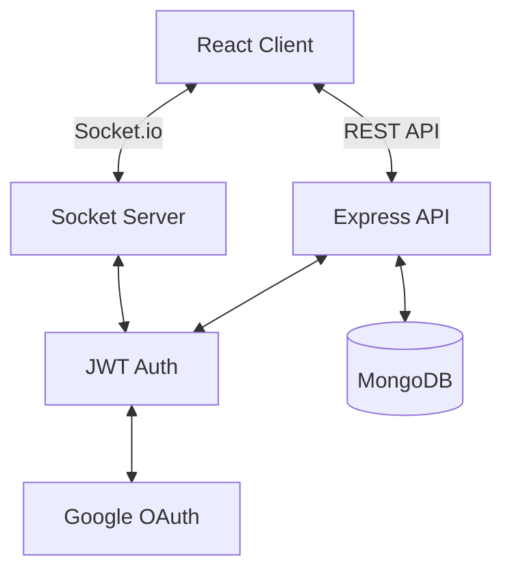

# 🎬 Chatflix

> **One chat. Every style.**
> A premium, high-performance real-time messaging application that seamlessly blends the visual DNA of the world's most iconic brands.


<div align="center">

[](https://reactjs.org/)
[](https://nodejs.org/)
[](https://www.mongodb.com/)
[](https://socket.io/)
[](https://styled-components.com/)

</div>

---

## ✨ Features

### 🎨 Dynamic Brand Theming
Experience a UI that shapeshifts. Switch instantly between meticulously crafted themes:
- **Netflix Mode:** Cinematic dark UI with signature red accents and bold typography.
- **Spotify Mode:** Deep blacks and vibrant greens with rounded, modern aesthetics.
- **Apple Mode:** Clean, minimalist iOS-inspired glassmorphism and blurs.
- **Instagram Mode:** Gradient-rich social feel with 'Stories' vibe.
- **Google Mode:** Material Design principles with playful colors and clean spacing.

### ⚡ Real-Time Everything
- **Instant Messaging:** Powered by Socket.io for sub-millisecond delivery.
- **Live Typing Indicators:** See when friends are replying.
- **Read Receipts:** WhatsApp-style ticks (Sent, Delivered, Read).
- **Online Status:** Real-time presence detection.

### 👥 Social Graph
- **Follow System:** Instagram-style Followers/Following architecture.
- **Smart Search:** MongoDB Aggregation-powered search engine prioritizing prefix matches for instant relevance.
- **Profile Hub:** Rich profile drawer with stats, edit capabilities, and image cropping.

### 🛠️ Engineering Excellence
- **Optimized Performance:** 50ms debounce search, React.memo optimizations, and skeleton loading states.
- **Robust Auth:** Secure Google OAuth 2.0 + JWT persistence (365-day sessions).
- **Responsive Design:** Fluid layouts that adapt from ultra-wide desktops to mobile viewports.

---

## 📸 Screenshots

| Landing Page | Chat Interface |
|:---:|:---:|
|  |  |

| Profile Drawer | Theme Switcher |
|:---:|:---:|
|  |  |

*(Add your screenshots here)*

---

## 🚀 Getting Started

### Prerequisites
- Node.js (v16+)
- MongoDB (Local or Atlas URI)
- Google Cloud Console Project (for OAuth)

### Installation

1.  **Clone the repository**
    ```bash
    git clone https://github.com/yourusername/chatflix.git
    cd chatflix
    ```

2.  **Install Dependencies**
    ```bash
    # Install backend deps
    npm install

    # Install client deps
    cd client
    npm install
    cd ..
    ```

3.  **Environment Configuration**
    Create a `.env` file in the root directory:
    ```env
    PORT=5000
    MONGO_URI=your_mongodb_connection_string
    JWT_SECRET=your_super_secret_key
    CLIENT_URL=http://localhost:3000
    GOOGLE_CLIENT_ID=your_google_client_id
    GOOGLE_CLIENT_SECRET=your_google_client_secret
    ```

4.  **Run Development Server**
    ```bash
    npm run dev
    ```
    *Starts Backend on :5000 and React Client on :3000*

---

## 🏗️ Architecture



## 🤝 Contributing

Contributions are welcome! Please feel free to submit a Pull Request.

1.  Fork the Project
2.  Create your Feature Branch (`git checkout -b feature/AmazingFeature`)
3.  Commit your Changes (`git commit -m 'Add some AmazingFeature'`)
4.  Push to the Branch (`git push origin feature/AmazingFeature`)
5.  Open a Pull Request

## 📄 License

Distributed under the MIT License. See `LICENSE` for more information.

---

<p align="center">
  Built with ❤️ by [Your Name]
</p>